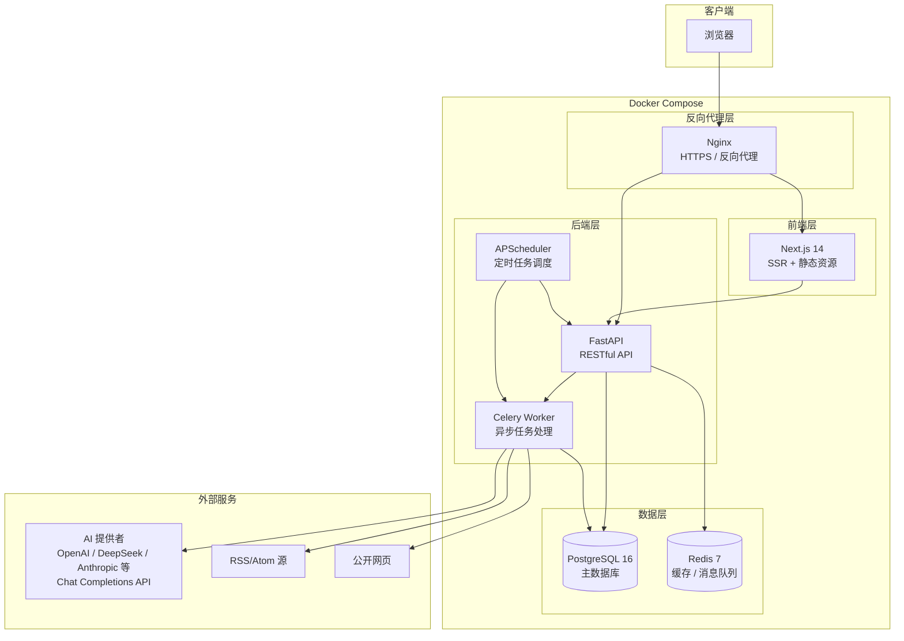
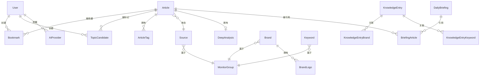

# 技术方案设计文档：潮流情报编辑工作台（Fashion Intel Workbench）

## 概述

潮流情报编辑工作台是一个面向潮流编辑的全球时尚资讯 AI 情报平台，核心能力包括：资讯自动聚合采集、AI 中文摘要与标签、多维度筛选搜索、收藏与选题管理、每日简报生成、潮流知识库与资讯联动。

系统采用前后端分离架构，前端使用 Next.js 构建高品质时尚杂志感 UI，后端使用 Python FastAPI 提供 RESTful API，PostgreSQL 作为主数据库，Redis 用于缓存和任务队列。AI 能力通过统一的提供者适配层（AI Provider Adapter）调用，支持 OpenAI 及所有兼容 OpenAI Chat Completions API 协议的第三方模型（如 DeepSeek、Anthropic 等），用户可在设置页自行配置 API Key 和 API URL。整体通过 Docker Compose 容器化部署到海外云服务器。

### 技术栈选型

| 层级 | 技术选型 | 选型理由 |
|------|----------|----------|
| **前端框架** | Next.js 14 (App Router) + TypeScript | SSR/SSG 支持、优秀的 SEO 和首屏性能、App Router 提供现代化路由和布局系统 |
| **UI 组件库** | Tailwind CSS + Radix UI + Framer Motion | Tailwind 提供灵活的样式定制能力，Radix UI 提供无样式但可访问的基础组件，Framer Motion 提供流畅动效 |
| **后端框架** | Python FastAPI | 异步支持好、自动生成 OpenAPI 文档、类型安全、生态丰富适合 AI 集成 |
| **数据库** | PostgreSQL 16 | 成熟稳定、支持全文搜索（中英文）、JSONB 灵活存储、扩展性好 |
| **搜索增强** | PostgreSQL pg_trgm + zhparser | 利用 PostgreSQL 内置全文搜索能力，zhparser 提供中文分词支持 |
| **缓存/队列** | Redis 7 | 用于 API 响应缓存、定时任务调度（通过 APScheduler）、速率限制 |
| **任务调度** | APScheduler + Celery | APScheduler 处理定时采集任务，Celery + Redis 处理异步 AI 分析任务 |
| **AI 服务** | OpenAI 兼容 API（可配置） | 通过统一适配层调用，默认 OpenAI GPT-4o，支持用户配置 DeepSeek、Anthropic 等兼容 Chat Completions API 的第三方模型 |
| **AI 适配层** | openai Python SDK | 利用 openai SDK 的 `base_url` 参数实现多提供者切换，无需为每个提供者编写独立客户端 |
| **密钥加密** | cryptography (Fernet) | 对用户配置的 API Key 进行对称加密存储，密钥通过环境变量管理 |
| **RSS 解析** | feedparser | Python 成熟的 RSS/Atom 解析库 |
| **网页采集** | httpx + BeautifulSoup4 | httpx 提供异步 HTTP 客户端，BeautifulSoup4 解析 HTML |
| **认证** | JWT (PyJWT) | 轻量级 token 认证，适合前后端分离架构 |
| **容器化** | Docker + Docker Compose | 统一部署环境，简化运维 |
| **反向代理** | Nginx | HTTPS 终端、静态资源服务、反向代理 |

## 架构

### 系统架构图



### 架构设计决策

1. **前后端分离**：前端 Next.js 负责 UI 渲染和交互，后端 FastAPI 提供纯 API 服务。这样前端可以充分利用 Next.js 的 SSR 能力提升首屏体验，后端专注于业务逻辑和 AI 集成。

2. **异步任务处理**：资讯采集和 AI 分析是耗时操作，通过 Celery + Redis 异步处理，避免阻塞 API 响应。APScheduler 负责定时触发采集任务。

3. **PostgreSQL 全文搜索**：第一版不引入 Elasticsearch 等独立搜索引擎，利用 PostgreSQL 的 `pg_trgm` 扩展和 `zhparser` 中文分词插件实现全文搜索，降低运维复杂度。如果未来数据量增长到需要更强搜索能力时再引入。

4. **单体后端 + 模块化设计**：第一版采用单体 FastAPI 应用，但内部按功能模块划分（articles、ai_service、knowledge、admin 等），预留未来拆分微服务的能力。

5. **AI 服务适配层**：AI 调用通过统一的 `AIProviderAdapter` 适配层封装，利用 openai Python SDK 的 `base_url` 参数实现多提供者切换。所有兼容 OpenAI Chat Completions API 协议的提供者（OpenAI、DeepSeek、Anthropic 等）均可通过配置 API Key、Base URL 和模型名称接入，无需为每个提供者编写独立客户端。用户配置存储在 `ai_providers` 表中，API Key 使用 Fernet 对称加密存储。

6. **文件存储**：品牌 Logo 文件存储在本地文件系统的 `uploads/logos/` 目录下，通过 `FileStorageService` 统一管理上传、缩略图生成和下载。第一版使用本地存储，预留未来切换到 S3 等对象存储的接口。上传时自动生成缩略图用于列表展示，下载时返回原始文件。

### 目录结构

```
fashion-intel-workbench/
├── docker-compose.yml
├── docker-compose.prod.yml
├── .env.example
├── nginx/
│   └── nginx.conf
├── frontend/
│   ├── Dockerfile
│   ├── package.json
│   ├── tsconfig.json
│   ├── tailwind.config.ts
│   ├── next.config.js
│   ├── src/
│   │   ├── app/                    # Next.js App Router 页面
│   │   │   ├── layout.tsx          # 根布局
│   │   │   ├── page.tsx            # 仪表盘首页
│   │   │   ├── login/
│   │   │   ├── articles/
│   │   │   │   ├── page.tsx        # 资讯列表页
│   │   │   │   └── [id]/
│   │   │   │       └── page.tsx    # 资讯详情页
│   │   │   ├── bookmarks/
│   │   │   │   └── page.tsx        # 收藏/待选题页
│   │   │   ├── briefings/
│   │   │   │   ├── page.tsx        # 简报列表页
│   │   │   │   └── [id]/
│   │   │   │       └── page.tsx    # 简报详情页
│   │   │   ├── knowledge/
│   │   │   │   ├── page.tsx        # 知识库浏览页
│   │   │   │   └── [id]/
│   │   │   │       └── page.tsx    # 知识条目详情页
│   │   │   └── admin/
│   │   │       ├── sources/        # 资讯源管理
│   │   │       ├── brands/         # 品牌池管理
│   │   │       ├── keywords/       # 关键词池管理
│   │   │       ├── monitor-groups/ # 监控组管理
│   │   │       └── ai-providers/   # AI 提供者配置
│   │   ├── components/
│   │   │   ├── ui/                 # 基础 UI 组件
│   │   │   ├── articles/           # 资讯相关组件
│   │   │   ├── knowledge/          # 知识库相关组件
│   │   │   ├── dashboard/          # 仪表盘组件
│   │   │   ├── brands/             # 品牌写法与 Logo 组件
│   │   │   ├── ai-providers/       # AI 提供者配置组件
│   │   │   └── layout/             # 布局组件
│   │   ├── lib/
│   │   │   ├── api.ts              # API 客户端
│   │   │   ├── auth.ts             # 认证工具
│   │   │   └── utils.ts            # 通用工具
│   │   ├── hooks/                  # 自定义 React Hooks
│   │   ├── types/                  # TypeScript 类型定义
│   │   └── styles/
│   │       └── globals.css         # 全局样式
│   └── public/
│       └── fonts/                  # 自定义字体
├── backend/
│   ├── Dockerfile
│   ├── pyproject.toml
│   ├── alembic.ini
│   ├── alembic/                    # 数据库迁移
│   ├── app/
│   │   ├── main.py                 # FastAPI 应用入口
│   │   ├── config.py               # 配置管理
│   │   ├── database.py             # 数据库连接
│   │   ├── models/                 # SQLAlchemy 数据模型
│   │   │   ├── article.py
│   │   │   ├── source.py
│   │   │   ├── tag.py
│   │   │   ├── brand.py
│   │   │   ├── brand_logo.py
│   │   │   ├── keyword.py
│   │   │   ├── monitor_group.py
│   │   │   ├── bookmark.py
│   │   │   ├── briefing.py
│   │   │   ├── knowledge.py
│   │   │   ├── user.py
│   │   │   └── ai_provider.py
│   │   ├── schemas/                # Pydantic 请求/响应模型
│   │   ├── routers/                # API 路由
│   │   │   ├── articles.py
│   │   │   ├── bookmarks.py
│   │   │   ├── briefings.py
│   │   │   ├── knowledge.py
│   │   │   ├── admin.py
│   │   │   ├── dashboard.py
│   │   │   ├── auth.py
│   │   │   └── ai_providers.py
│   │   ├── services/               # 业务逻辑层
│   │   │   ├── article_service.py
│   │   │   ├── ai_service.py
│   │   │   ├── ai_provider_adapter.py  # AI 提供者适配层
│   │   │   ├── ai_provider_service.py  # AI 提供者配置管理
│   │   │   ├── encryption_service.py   # API Key 加密服务
│   │   │   ├── aggregation_service.py
│   │   │   ├── brand_service.py        # 品牌写法与 Logo 管理
│   │   │   ├── file_storage_service.py # 文件存储服务（Logo 上传/下载）
│   │   │   ├── briefing_service.py
│   │   │   ├── knowledge_service.py
│   │   │   └── search_service.py
│   │   ├── tasks/                  # Celery 异步任务
│   │   │   ├── celery_app.py
│   │   │   ├── aggregation_tasks.py
│   │   │   └── ai_tasks.py
│   │   ├── aggregation/            # 资讯采集模块
│   │   │   ├── base.py             # 采集器基类
│   │   │   ├── rss_collector.py    # RSS/Atom 采集器
│   │   │   ├── web_collector.py    # 网页采集器
│   │   │   └── dedup.py            # 去重逻辑
│   │   └── utils/
│   │       ├── auth.py             # JWT 认证
│   │       └── errors.py           # 错误处理
│   └── tests/
│       ├── conftest.py
│       ├── test_aggregation/
│       ├── test_ai_service/
│       ├── test_articles/
│       ├── test_brands/
│       ├── test_search/
│       └── test_knowledge/
├── scripts/
│   ├── init_db.py                  # 数据库初始化
│   └── seed_data.py                # 种子数据
└── uploads/
    └── logos/                      # 品牌 Logo 文件存储
```

## 组件与接口

### 后端 API 接口设计

所有 API 接口以 `/api/v1` 为前缀，返回统一的 JSON 响应格式：

```json
{
  "code": 200,
  "message": "success",
  "data": { ... }
}
```

分页响应格式：

```json
{
  "code": 200,
  "message": "success",
  "data": {
    "items": [...],
    "total": 100,
    "page": 1,
    "page_size": 20
  }
}
```

#### 认证接口

| 方法 | 路径 | 说明 |
|------|------|------|
| POST | `/api/v1/auth/login` | 用户登录，返回 JWT token |
| POST | `/api/v1/auth/refresh` | 刷新 token |
| GET | `/api/v1/auth/me` | 获取当前用户信息 |

#### 资讯接口

| 方法 | 路径 | 说明 |
|------|------|------|
| GET | `/api/v1/articles` | 获取资讯列表（支持筛选、搜索、分页） |
| GET | `/api/v1/articles/{id}` | 获取资讯详情 |
| PATCH | `/api/v1/articles/{id}/tags` | 编辑资讯标签 |
| POST | `/api/v1/articles/{id}/reprocess` | 手动触发重新 AI 分析 |
| POST | `/api/v1/articles/{id}/analyze` | 触发 AI 深度分析 |
| GET | `/api/v1/articles/{id}/analysis` | 获取 AI 深度分析结果 |
| GET | `/api/v1/articles/{id}/related-knowledge` | 获取资讯关联的知识条目 |
| POST | `/api/v1/articles/{id}/history-analysis` | 触发 AI 历史背景分析 |

资讯列表查询参数：

```
GET /api/v1/articles?page=1&page_size=20&brand=Nike&monitor_group=Sports&content_type=联名&start_date=2024-01-01&end_date=2024-01-31&keyword=球鞋&status=processed
```

#### 收藏与待选题接口

| 方法 | 路径 | 说明 |
|------|------|------|
| GET | `/api/v1/bookmarks` | 获取收藏列表（支持筛选、分页） |
| POST | `/api/v1/bookmarks` | 添加收藏 |
| DELETE | `/api/v1/bookmarks/{article_id}` | 取消收藏 |
| GET | `/api/v1/topic-candidates` | 获取待选题列表（支持筛选、分页） |
| POST | `/api/v1/topic-candidates` | 添加待选题 |
| DELETE | `/api/v1/topic-candidates/{article_id}` | 取消待选题 |

#### 每日简报接口

| 方法 | 路径 | 说明 |
|------|------|------|
| GET | `/api/v1/briefings` | 获取简报列表（按日期倒序，分页） |
| GET | `/api/v1/briefings/{id}` | 获取简报详情 |
| POST | `/api/v1/briefings/generate` | 手动触发生成当日简报 |

#### 知识库接口

| 方法 | 路径 | 说明 |
|------|------|------|
| GET | `/api/v1/knowledge` | 获取知识条目列表（支持按类别、关键词筛选） |
| GET | `/api/v1/knowledge/{id}` | 获取知识条目详情 |
| POST | `/api/v1/knowledge` | 创建知识条目 |
| PUT | `/api/v1/knowledge/{id}` | 编辑知识条目 |
| DELETE | `/api/v1/knowledge/{id}` | 删除知识条目 |

#### 仪表盘接口

| 方法 | 路径 | 说明 |
|------|------|------|
| GET | `/api/v1/dashboard/overview` | 获取仪表盘数据概览 |
| GET | `/api/v1/dashboard/recent-articles` | 获取最近资讯列表（最多 20 条） |
| GET | `/api/v1/dashboard/trending-tags` | 获取各监控组热门标签 |

#### 后台管理接口

| 方法 | 路径 | 说明 |
|------|------|------|
| GET | `/api/v1/admin/sources` | 获取资讯源列表 |
| POST | `/api/v1/admin/sources` | 添加资讯源 |
| PUT | `/api/v1/admin/sources/{id}` | 编辑资讯源 |
| PATCH | `/api/v1/admin/sources/{id}/toggle` | 启用/禁用资讯源 |
| DELETE | `/api/v1/admin/sources/{id}` | 删除资讯源 |
| GET | `/api/v1/admin/brands` | 获取品牌池列表 |
| POST | `/api/v1/admin/brands` | 添加品牌 |
| PUT | `/api/v1/admin/brands/{id}` | 编辑品牌 |
| DELETE | `/api/v1/admin/brands/{id}` | 删除品牌 |
| GET | `/api/v1/admin/brands/search-naming` | 搜索品牌官方写法（支持模糊匹配，查询参数 ?q=品牌名） |
| GET | `/api/v1/admin/brands/{id}/logos` | 获取品牌 Logo 文件列表（含缩略图 URL） |
| POST | `/api/v1/admin/brands/{id}/logos` | 上传品牌 Logo 文件（multipart/form-data） |
| PUT | `/api/v1/admin/brands/{id}/logos/{logo_id}` | 更新 Logo 元数据（类型、文件名） |
| DELETE | `/api/v1/admin/brands/{id}/logos/{logo_id}` | 删除品牌 Logo 文件 |
| GET | `/api/v1/admin/brands/{id}/logos/{logo_id}/download` | 下载品牌 Logo 原始文件 |
| GET | `/api/v1/admin/keywords` | 获取关键词池列表 |
| POST | `/api/v1/admin/keywords` | 添加关键词 |
| PUT | `/api/v1/admin/keywords/{id}` | 编辑关键词 |
| DELETE | `/api/v1/admin/keywords/{id}` | 删除关键词 |
| GET | `/api/v1/admin/monitor-groups` | 获取监控组列表 |
| PUT | `/api/v1/admin/monitor-groups/{id}` | 编辑监控组 |

#### AI 提供者配置接口

| 方法 | 路径 | 说明 |
|------|------|------|
| GET | `/api/v1/ai-providers` | 获取所有 AI 提供者配置列表（API Key 以掩码返回） |
| GET | `/api/v1/ai-providers/active` | 获取当前激活的 AI 提供者配置 |
| POST | `/api/v1/ai-providers` | 添加自定义 AI 提供者 |
| PUT | `/api/v1/ai-providers/{id}` | 编辑 AI 提供者配置 |
| DELETE | `/api/v1/ai-providers/{id}` | 删除自定义 AI 提供者（预置提供者不可删除） |
| PATCH | `/api/v1/ai-providers/{id}/activate` | 设置为当前使用的 AI 提供者 |
| POST | `/api/v1/ai-providers/{id}/test` | 测试 AI 提供者连接有效性 |

AI 提供者配置请求体：

```json
{
  "name": "DeepSeek",
  "api_key": "sk-xxx",
  "api_base_url": "https://api.deepseek.com/v1",
  "model_name": "deepseek-chat",
  "is_active": false
}
```

AI 提供者列表响应（API Key 掩码处理）：

```json
{
  "code": 200,
  "message": "success",
  "data": [
    {
      "id": "uuid",
      "name": "OpenAI",
      "api_key_masked": "sk-****...****a1b2",
      "api_base_url": "https://api.openai.com/v1",
      "model_name": "gpt-4o",
      "is_preset": true,
      "is_active": true,
      "last_test_at": "2024-01-15T10:30:00Z",
      "last_test_status": "success"
    }
  ]
}
```

连接测试响应：

```json
{
  "code": 200,
  "message": "success",
  "data": {
    "status": "success",
    "response_time_ms": 1200,
    "model_info": "gpt-4o"
  }
}
```

连接测试失败响应：

```json
{
  "code": 200,
  "message": "success",
  "data": {
    "status": "failed",
    "error_type": "auth_failed",
    "error_message": "认证失败：API Key 无效或已过期"
  }
}
```

### 前端组件设计

#### 布局组件

- **`AppLayout`**：全局布局，包含侧边导航栏和主内容区域
- **`Sidebar`**：侧边导航栏，包含页面导航链接和用户信息
- **`PageHeader`**：页面标题栏，包含面包屑导航和操作按钮

#### 资讯组件

- **`ArticleCard`**：资讯卡片，展示中文摘要、英文原标题、来源、时间、标签、收藏/待选题按钮
- **`ArticleList`**：资讯列表容器，支持无限滚动加载
- **`ArticleFilters`**：筛选面板，包含品牌、监控组、内容类型、时间范围筛选器和搜索框
- **`ArticleDetail`**：资讯详情展示，包含完整摘要、原文信息、标签编辑
- **`AIAnalysisPanel`**：AI 深度分析展示面板，支持加载状态和重试
- **`RelatedKnowledge`**：相关历史背景模块，展示关联知识条目摘要
- **`TagEditor`**：标签编辑器，支持添加、删除标签

#### 仪表盘组件

- **`StatsOverview`**：数据概览卡片组（今日新增、各组分布、待处理、收藏总数）
- **`BriefingSummary`**：今日简报摘要卡片
- **`RecentArticles`**：最近资讯列表
- **`TrendingTags`**：热门标签词云/列表

#### 知识库组件

- **`KnowledgeGrid`**：知识条目网格展示
- **`KnowledgeDetail`**：知识条目详情，包含时间线、关键事件、关联信息
- **`KnowledgeEditor`**：知识条目编辑表单

#### 简报组件

- **`BriefingList`**：简报列表，按日期倒序
- **`BriefingDetail`**：简报详情展示，支持资讯链接跳转

#### AI 提供者配置组件

- **`AIProviderList`**：AI 提供者列表，展示所有已配置的提供者，标识当前激活的提供者和预置提供者
- **`AIProviderForm`**：AI 提供者配置表单，包含提供者名称、API Key（输入后掩码显示）、API Base URL、模型名称字段
- **`AIProviderCard`**：单个 AI 提供者卡片，展示配置摘要、激活状态、最近测试结果，提供编辑/删除/激活/测试操作按钮
- **`ConnectionTestButton`**：连接测试按钮，点击后发起测试请求，展示测试结果（成功/失败及错误类型）
- **`APIKeyInput`**：API Key 专用输入组件，输入后自动掩码显示，支持显示/隐藏切换
- **`AIErrorAlert`**：AI 调用错误提示组件，根据错误类型（认证失败、配额不足、网络超时）展示对应的错误信息和建议操作

#### 品牌写法与 Logo 组件

- **`BrandNamingSearch`**：品牌写法搜索组件，输入品牌名称（支持模糊匹配），展示官方写法、社交媒体写法和备注
- **`BrandNamingCard`**：品牌写法展示卡片，展示品牌的官方英文写法、社交媒体写法、写法备注
- **`BrandNamingBadge`**：品牌写法提示徽章，在资讯详情页中以小提示展示品牌的官方写法
- **`BrandLogoGallery`**：品牌 Logo 画廊，展示品牌所有已上传的 Logo 缩略图，支持按类型筛选
- **`BrandLogoUploader`**：Logo 上传组件，支持拖拽上传，选择 Logo 类型（主 Logo / 横版 / 图标 / 单色版等）
- **`BrandLogoCard`**：单个 Logo 卡片，展示缩略图、文件名、格式、类型，提供下载和删除按钮

#### 通用 UI 组件

- **`LoadingSpinner`**：加载状态指示器
- **`ErrorMessage`**：错误提示组件，支持重试按钮
- **`EmptyState`**：空状态占位组件
- **`Pagination`**：分页组件
- **`TagBadge`**：标签徽章
- **`SearchInput`**：搜索输入框
- **`DateRangePicker`**：日期范围选择器
- **`ConfirmDialog`**：确认对话框

### AI 服务接口设计

AI 服务采用两层架构：上层 `AIServiceBase` 定义业务接口，下层 `AIProviderAdapter` 负责根据用户配置动态切换 AI 提供者。

#### AI 提供者适配层

适配层利用 openai Python SDK 的 `base_url` 参数，实现对所有兼容 OpenAI Chat Completions API 协议的提供者的统一调用。每次调用时从数据库读取当前激活的提供者配置，解密 API Key 后构建客户端实例。

```python
class AIProviderAdapter:
    """AI 提供者适配层 —— 统一封装对 OpenAI 兼容 API 的调用"""

    def __init__(self, encryption_service: EncryptionService, db: AsyncSession):
        self.encryption_service = encryption_service
        self.db = db

    async def get_active_provider(self) -> AIProvider:
        """从数据库获取当前激活的 AI 提供者配置"""

    async def create_client(self) -> AsyncOpenAI:
        """根据当前激活的提供者配置创建 openai 客户端实例
        
        - 从数据库读取激活的提供者配置
        - 解密 API Key
        - 使用 api_key 和 base_url 构建 AsyncOpenAI 客户端
        """

    async def chat_completion(self, messages: list[dict], **kwargs) -> str:
        """发送 Chat Completions 请求并返回响应文本
        
        - 自动使用当前激活提供者的 model_name
        - 捕获并分类错误（认证失败、配额不足、网络超时）
        """

    async def test_connection(self, provider: AIProvider) -> ConnectionTestResult:
        """测试指定提供者的连接有效性
        
        - 发送一个简单的 Chat Completions 请求
        - 返回测试结果（成功/失败、响应时间、错误类型）
        """


class ConnectionTestResult:
    """连接测试结果"""
    status: str          # "success" | "failed"
    response_time_ms: int
    error_type: str | None    # "auth_failed" | "quota_exceeded" | "network_timeout" | None
    error_message: str | None


class EncryptionService:
    """API Key 加密服务"""

    def __init__(self, encryption_key: str):
        """使用环境变量中的密钥初始化 Fernet 加密器"""

    def encrypt(self, plaintext: str) -> str:
        """加密明文，返回密文字符串"""

    def decrypt(self, ciphertext: str) -> str:
        """解密密文，返回明文字符串"""

    @staticmethod
    def mask_api_key(api_key: str) -> str:
        """将 API Key 转为掩码格式，如 sk-****...****a1b2（保留前3位和后4位）"""
```

#### AI 业务服务接口

AI 业务服务通过 `AIServiceBase` 抽象类定义统一接口，内部通过 `AIProviderAdapter` 调用具体的 AI 模型：

```python
class AIServiceBase(ABC):
    """AI 服务抽象基类"""

    def __init__(self, provider_adapter: AIProviderAdapter):
        self.provider_adapter = provider_adapter

    @abstractmethod
    async def generate_summary(self, title: str, content: str, source_lang: str) -> str:
        """生成中文摘要（不超过 200 字）"""

    @abstractmethod
    async def extract_tags(self, title: str, content: str, brand_pool: list[str], keyword_pool: list[str]) -> ArticleTags:
        """提取标签（品牌、监控组、内容类型）"""

    @abstractmethod
    async def generate_deep_analysis(self, title: str, summary: str, tags: ArticleTags) -> DeepAnalysis:
        """生成深度分析报告（重要性、背景、跟进方向）"""

    @abstractmethod
    async def generate_daily_briefing(self, articles: list[ArticleSummary], date: date) -> DailyBriefing:
        """生成每日简报"""

    @abstractmethod
    async def generate_history_analysis(self, article_summary: str, knowledge_entries: list[KnowledgeEntry]) -> str:
        """生成历史背景分析"""

    @abstractmethod
    async def match_knowledge_entries(self, article_tags: ArticleTags, knowledge_entries: list[KnowledgeEntry]) -> list[KnowledgeEntry]:
        """匹配相关知识条目"""
```

#### AI 错误分类

AI 调用失败时，适配层将异常分类为以下错误类型，前端根据错误类型展示对应的用户提示：

| 错误类型 | 错误码 | 说明 | 用户提示 |
|----------|--------|------|----------|
| `auth_failed` | 401 | API Key 无效或已过期 | "认证失败：请检查 API Key 是否正确" |
| `quota_exceeded` | 429 | API 配额不足或请求频率超限 | "配额不足：请检查 API 账户余额或稍后重试" |
| `network_timeout` | timeout | 网络连接超时 | "网络超时：请检查网络连接或 API URL 是否正确" |
| `model_not_found` | 404 | 指定的模型名称不存在 | "模型不存在：请检查模型名称是否正确" |
| `server_error` | 5xx | AI 提供者服务端错误 | "服务暂时不可用，请稍后重试" |

### 资讯聚合引擎接口设计

```python
class BaseCollector(ABC):
    """采集器基类"""

    @abstractmethod
    async def collect(self, source: Source) -> list[RawArticle]:
        """从指定资讯源采集原始资讯"""

    @abstractmethod
    async def validate_source(self, source: Source) -> bool:
        """验证资讯源是否可达"""


class RSSCollector(BaseCollector):
    """RSS/Atom 采集器"""

class WebCollector(BaseCollector):
    """网页采集器"""


class DeduplicationService:
    """去重服务"""

    async def is_duplicate(self, article: RawArticle) -> bool:
        """基于原文链接和标题相似度判断是否重复"""

    def compute_title_similarity(self, title_a: str, title_b: str) -> float:
        """计算标题相似度（0.0 ~ 1.0）"""
```


## 数据模型

### ER 关系图



### 数据表定义

#### users 表

| 字段 | 类型 | 约束 | 说明 |
|------|------|------|------|
| id | UUID | PK | 用户 ID |
| username | VARCHAR(100) | UNIQUE, NOT NULL | 用户名 |
| password_hash | VARCHAR(255) | NOT NULL | 密码哈希 |
| display_name | VARCHAR(100) | | 显示名称 |
| is_active | BOOLEAN | DEFAULT true | 是否启用 |
| created_at | TIMESTAMP | NOT NULL | 创建时间 |
| updated_at | TIMESTAMP | NOT NULL | 更新时间 |

#### monitor_groups 表

| 字段 | 类型 | 约束 | 说明 |
|------|------|------|------|
| id | UUID | PK | 监控组 ID |
| name | VARCHAR(100) | UNIQUE, NOT NULL | 监控组名称（如 Luxury） |
| display_name | VARCHAR(100) | NOT NULL | 显示名称（如 奢侈品） |
| description | TEXT | | 描述 |
| sort_order | INTEGER | DEFAULT 0 | 排序权重 |
| created_at | TIMESTAMP | NOT NULL | 创建时间 |
| updated_at | TIMESTAMP | NOT NULL | 更新时间 |

#### sources 表

| 字段 | 类型 | 约束 | 说明 |
|------|------|------|------|
| id | UUID | PK | 资讯源 ID |
| name | VARCHAR(200) | NOT NULL | 资讯源名称 |
| url | VARCHAR(500) | NOT NULL | 资讯源 URL |
| source_type | VARCHAR(20) | NOT NULL | 类型：rss / web |
| monitor_group_id | UUID | FK → monitor_groups.id | 所属监控组 |
| is_enabled | BOOLEAN | DEFAULT true | 是否启用 |
| collect_interval_minutes | INTEGER | DEFAULT 60 | 采集间隔（分钟） |
| last_collected_at | TIMESTAMP | | 最近采集时间 |
| last_collect_status | VARCHAR(20) | | 最近采集状态：success / error |
| last_error_message | TEXT | | 最近错误信息 |
| config | JSONB | | 采集配置（如网页采集的 CSS 选择器等） |
| created_at | TIMESTAMP | NOT NULL | 创建时间 |
| updated_at | TIMESTAMP | NOT NULL | 更新时间 |

#### articles 表

| 字段 | 类型 | 约束 | 说明 |
|------|------|------|------|
| id | UUID | PK | 资讯 ID |
| source_id | UUID | FK → sources.id | 来源 |
| original_title | VARCHAR(500) | NOT NULL | 原文标题 |
| original_url | VARCHAR(1000) | UNIQUE, NOT NULL | 原文链接 |
| original_language | VARCHAR(10) | NOT NULL | 原文语言（如 en, zh, ja） |
| original_excerpt | TEXT | | 原文摘录 |
| chinese_summary | TEXT | | 中文摘要 |
| published_at | TIMESTAMP | | 原文发布时间 |
| collected_at | TIMESTAMP | NOT NULL | 采集时间 |
| processing_status | VARCHAR(20) | NOT NULL, DEFAULT 'pending' | 处理状态：pending / processing / processed / failed |
| title_hash | VARCHAR(64) | INDEX | 标题哈希（用于去重） |
| created_at | TIMESTAMP | NOT NULL | 创建时间 |
| updated_at | TIMESTAMP | NOT NULL | 更新时间 |

索引：
- `idx_articles_published_at` ON (published_at DESC)
- `idx_articles_source_id` ON (source_id)
- `idx_articles_processing_status` ON (processing_status)
- `idx_articles_original_url` ON (original_url) — UNIQUE
- `idx_articles_title_hash` ON (title_hash)
- `idx_articles_fts` ON (to_tsvector('chinese', chinese_summary) || to_tsvector('english', original_title)) — 全文搜索

#### article_tags 表

| 字段 | 类型 | 约束 | 说明 |
|------|------|------|------|
| id | UUID | PK | 标签关联 ID |
| article_id | UUID | FK → articles.id | 资讯 ID |
| tag_type | VARCHAR(20) | NOT NULL | 标签类型：brand / monitor_group / content_type / keyword |
| tag_value | VARCHAR(200) | NOT NULL | 标签值 |
| is_auto | BOOLEAN | DEFAULT true | 是否 AI 自动生成 |
| created_at | TIMESTAMP | NOT NULL | 创建时间 |

索引：
- `idx_article_tags_article_id` ON (article_id)
- `idx_article_tags_type_value` ON (tag_type, tag_value)
- UNIQUE (article_id, tag_type, tag_value)

#### brands 表

| 字段 | 类型 | 约束 | 说明 |
|------|------|------|------|
| id | UUID | PK | 品牌 ID |
| name_zh | VARCHAR(200) | NOT NULL | 中文名 |
| name_en | VARCHAR(200) | NOT NULL | 英文名 |
| official_name | VARCHAR(200) | | 官方英文写法（如 "LOUIS VUITTON"、"adidas"、"Off-White™"） |
| social_media_name | VARCHAR(200) | | 社交媒体常用写法 |
| naming_notes | TEXT | | 写法备注说明（如"全大写"、"全小写"、"含™符号"等） |
| monitor_group_id | UUID | FK → monitor_groups.id | 所属监控组 |
| created_at | TIMESTAMP | NOT NULL | 创建时间 |
| updated_at | TIMESTAMP | NOT NULL | 更新时间 |

#### brand_logos 表

| 字段 | 类型 | 约束 | 说明 |
|------|------|------|------|
| id | UUID | PK | Logo 文件 ID |
| brand_id | UUID | FK → brands.id, NOT NULL | 所属品牌 |
| file_name | VARCHAR(300) | NOT NULL | 文件名 |
| file_path | VARCHAR(500) | NOT NULL | 文件存储路径 |
| file_format | VARCHAR(10) | NOT NULL | 文件格式：png / svg / jpg |
| logo_type | VARCHAR(50) | NOT NULL | Logo 类型：main / horizontal / icon / monochrome / other |
| file_size_bytes | INTEGER | | 文件大小（字节） |
| thumbnail_path | VARCHAR(500) | | 缩略图存储路径 |
| created_at | TIMESTAMP | NOT NULL | 上传时间 |

索引：
- `idx_brand_logos_brand_id` ON (brand_id)

#### keywords 表

| 字段 | 类型 | 约束 | 说明 |
|------|------|------|------|
| id | UUID | PK | 关键词 ID |
| word_zh | VARCHAR(200) | NOT NULL | 中文词 |
| word_en | VARCHAR(200) | NOT NULL | 英文词 |
| monitor_group_id | UUID | FK → monitor_groups.id | 所属监控组 |
| created_at | TIMESTAMP | NOT NULL | 创建时间 |
| updated_at | TIMESTAMP | NOT NULL | 更新时间 |

#### bookmarks 表

| 字段 | 类型 | 约束 | 说明 |
|------|------|------|------|
| id | UUID | PK | 收藏 ID |
| user_id | UUID | FK → users.id | 用户 ID |
| article_id | UUID | FK → articles.id | 资讯 ID |
| created_at | TIMESTAMP | NOT NULL | 收藏时间 |

约束：UNIQUE (user_id, article_id)

#### topic_candidates 表

| 字段 | 类型 | 约束 | 说明 |
|------|------|------|------|
| id | UUID | PK | 待选题 ID |
| user_id | UUID | FK → users.id | 用户 ID |
| article_id | UUID | FK → articles.id | 资讯 ID |
| created_at | TIMESTAMP | NOT NULL | 标记时间 |

约束：UNIQUE (user_id, article_id)

#### deep_analyses 表

| 字段 | 类型 | 约束 | 说明 |
|------|------|------|------|
| id | UUID | PK | 分析 ID |
| article_id | UUID | FK → articles.id, UNIQUE | 资讯 ID |
| importance | TEXT | NOT NULL | 重要性说明 |
| industry_background | TEXT | NOT NULL | 行业背景分析 |
| follow_up_suggestions | TEXT | NOT NULL | 跟进方向建议 |
| created_at | TIMESTAMP | NOT NULL | 生成时间 |

#### daily_briefings 表

| 字段 | 类型 | 约束 | 说明 |
|------|------|------|------|
| id | UUID | PK | 简报 ID |
| briefing_date | DATE | UNIQUE, NOT NULL | 简报日期 |
| content | JSONB | NOT NULL | 简报内容（结构化 JSON） |
| has_new_articles | BOOLEAN | DEFAULT true | 当日是否有新资讯 |
| created_at | TIMESTAMP | NOT NULL | 生成时间 |

`content` JSONB 结构：
```json
{
  "summary": "当日总体概述",
  "sections": [
    {
      "monitor_group": "Luxury",
      "highlights": [
        {
          "article_id": "uuid",
          "title": "资讯标题",
          "summary": "摘要"
        }
      ]
    }
  ],
  "trends": ["趋势1", "趋势2"],
  "follow_up_suggestions": ["建议1", "建议2"]
}
```

#### briefing_articles 表

| 字段 | 类型 | 约束 | 说明 |
|------|------|------|------|
| id | UUID | PK | 关联 ID |
| briefing_id | UUID | FK → daily_briefings.id | 简报 ID |
| article_id | UUID | FK → articles.id | 资讯 ID |

#### knowledge_entries 表

| 字段 | 类型 | 约束 | 说明 |
|------|------|------|------|
| id | UUID | PK | 知识条目 ID |
| title | VARCHAR(300) | NOT NULL | 标题 |
| category | VARCHAR(50) | NOT NULL | 类别：brand_profile / style_history / classic_item / person_profile |
| content | JSONB | NOT NULL | 结构化内容 |
| summary | TEXT | | 摘要 |
| created_at | TIMESTAMP | NOT NULL | 创建时间 |
| updated_at | TIMESTAMP | NOT NULL | 更新时间 |

`content` JSONB 结构（以品牌档案为例）：
```json
{
  "founded_year": 1947,
  "founder": "Christian Dior",
  "headquarters": "Paris, France",
  "timeline": [
    { "year": 1947, "event": "创立品牌，推出 New Look" },
    { "year": 1957, "event": "Yves Saint Laurent 接任设计总监" }
  ],
  "key_facts": ["关键信息1", "关键信息2"],
  "related_styles": ["New Look", "高级定制"],
  "description": "详细描述文本"
}
```

#### knowledge_entry_brands 表

| 字段 | 类型 | 约束 | 说明 |
|------|------|------|------|
| knowledge_entry_id | UUID | FK → knowledge_entries.id | 知识条目 ID |
| brand_name | VARCHAR(200) | NOT NULL | 关联品牌名 |

PK: (knowledge_entry_id, brand_name)

#### knowledge_entry_keywords 表

| 字段 | 类型 | 约束 | 说明 |
|------|------|------|------|
| knowledge_entry_id | UUID | FK → knowledge_entries.id | 知识条目 ID |
| keyword | VARCHAR(200) | NOT NULL | 关联关键词 |

PK: (knowledge_entry_id, keyword)

#### ai_providers 表

| 字段 | 类型 | 约束 | 说明 |
|------|------|------|------|
| id | UUID | PK | AI 提供者 ID |
| user_id | UUID | FK → users.id | 所属用户（预留多用户） |
| name | VARCHAR(100) | NOT NULL | 提供者名称（如 OpenAI、DeepSeek） |
| api_key_encrypted | TEXT | NOT NULL | 加密后的 API Key |
| api_base_url | VARCHAR(500) | NOT NULL | API Base URL（如 https://api.openai.com/v1） |
| model_name | VARCHAR(200) | NOT NULL | 模型名称（如 gpt-4o、deepseek-chat） |
| is_preset | BOOLEAN | DEFAULT false | 是否为系统预置提供者 |
| is_active | BOOLEAN | DEFAULT false | 是否为当前激活的提供者 |
| last_test_at | TIMESTAMP | | 最近连接测试时间 |
| last_test_status | VARCHAR(20) | | 最近测试状态：success / failed |
| last_test_error | TEXT | | 最近测试错误信息 |
| created_at | TIMESTAMP | NOT NULL | 创建时间 |
| updated_at | TIMESTAMP | NOT NULL | 更新时间 |

约束：
- 每个用户最多只能有一个 `is_active = true` 的提供者（通过应用层保证）
- `is_preset = true` 的提供者不可被删除


## 正确性属性（Correctness Properties）

*正确性属性是在系统所有合法执行中都应成立的特征或行为——本质上是对系统应做什么的形式化陈述。属性是连接人类可读规格说明与机器可验证正确性保证之间的桥梁。*

### 属性 1：去重判断对称性

*对于任意*两条资讯 A 和 B，如果 A 相对于 B 被判定为重复，则 B 相对于 A 也应被判定为重复。即去重判断函数 `is_duplicate(A, B) == is_duplicate(B, A)`。

**验证需求：1.2**

### 属性 2：资讯元数据完整性

*对于任意*采集并存储的资讯，以下字段均不为空：原文标题（original_title）、原文链接（original_url）、来源（source_id）、采集时间（collected_at）、原文语言（original_language）。

**验证需求：1.3**

### 属性 3：中文资讯跳过翻译

*对于任意*原文语言为中文（original_language = "zh"）的资讯，AI 分析服务不应调用翻译/摘要生成流程，而应直接使用原文内容作为中文摘要。

**验证需求：2.4**

### 属性 4：中文摘要长度约束

*对于任意*经 AI 分析服务处理后的资讯，其中文摘要（chinese_summary）的字符数不超过 200。

**验证需求：3.1**

### 属性 5：标签提取合法性

*对于任意*经 AI 分析服务提取标签后的资讯，所有标签的类型（tag_type）必须在合法集合 {brand, monitor_group, content_type, keyword} 内，且所有 brand 类型的标签值必须是当前品牌池中已配置品牌的子集。

**验证需求：3.2, 3.3**

### 属性 6：资讯筛选正确性

*对于任意*筛选条件组合（品牌、监控组、内容类型、时间范围），返回的所有资讯必须同时满足每一个指定的筛选条件。即：若指定了品牌 B，则每条结果都包含品牌标签 B；若指定了时间范围 [T1, T2]，则每条结果的发布时间都在 [T1, T2] 内；以此类推。

**验证需求：4.1, 4.2, 4.3, 4.4, 4.6**

### 属性 7：关键词搜索命中

*对于任意*关键词搜索查询 Q，返回的每条资讯至少在以下字段之一中包含 Q 的匹配：中文摘要（chinese_summary）、英文原标题（original_title）、标签值（tag_value）。

**验证需求：4.5**

### 属性 8：用户标记 round-trip

*对于任意*资讯和用户，执行收藏（或标记待选题）操作后，该资讯应出现在用户的收藏（或待选题）列表中；再次执行取消操作后，该资讯不应出现在对应列表中。

**验证需求：5.1, 5.2, 5.5**

### 属性 9：深度分析报告结构完整性

*对于任意*成功生成的深度分析报告，必须同时包含三个非空部分：重要性说明（importance）、行业背景分析（industry_background）、跟进方向建议（follow_up_suggestions）。

**验证需求：6.2**

### 属性 10：每日简报结构完整性

*对于任意*成功生成的每日简报，必须包含以下非空部分：当日重点资讯摘要（按监控组分类的 sections）、值得关注的趋势和热点（trends）、编辑建议跟进方向（follow_up_suggestions）。

**验证需求：7.2**

### 属性 11：简报列表日期倒序

*对于任意*简报列表查询结果，列表中每一项的简报日期（briefing_date）必须大于等于其后一项的简报日期，即严格按日期倒序排列。

**验证需求：7.3**

### 属性 12：知识条目类别合法性

*对于任意*知识条目，其类别（category）必须在合法集合 {brand_profile, style_history, classic_item, person_profile} 内。

**验证需求：8.1**

### 属性 13：知识条目元数据完整性

*对于任意*存储的知识条目，以下字段均不为空：标题（title）、类别（category）、创建时间（created_at）、更新时间（updated_at）。

**验证需求：8.5**

### 属性 14：知识库匹配相关性

*对于任意*资讯的标签集合和知识库，匹配返回的每条知识条目至少与该资讯共享一个品牌名或关键词。即匹配结果与资讯在品牌或关键词维度上有非空交集。

**验证需求：9.1**

### 属性 15：仪表盘最近资讯约束

*对于任意*仪表盘最近资讯查询结果，返回的资讯数量不超过 20 条，且按发布时间（published_at）倒序排列。

**验证需求：11.3**

### 属性 16：未认证请求拒绝

*对于任意*受保护的 API 端点，不携带有效 JWT token 的请求应返回 401 Unauthorized 状态码，不返回业务数据。

**验证需求：13.2**

### 属性 17：AI 适配层使用当前激活配置

*对于任意*已激活的 AI 提供者配置，AI 适配层构建的客户端实例应使用该配置的 api_base_url 和 model_name。当用户切换激活的提供者后，下一次 AI 调用应使用新激活提供者的配置。

**验证需求：14.3, 14.4**

### 属性 18：AI 提供者 CRUD round-trip

*对于任意*合法的 AI 提供者配置（名称、API Key、Base URL、模型名称），创建后应出现在提供者列表中，且列表中该提供者的名称、Base URL、模型名称与创建时一致。

**验证需求：14.2**

### 属性 19：API Key 加密存储与掩码展示

*对于任意* API Key，存储到数据库后的 api_key_encrypted 字段值不等于原始明文 API Key；通过 API 读取时返回的 api_key_masked 字段为掩码格式（保留前 3 位和后 4 位，中间以星号替代）。加密后解密应还原为原始 API Key（round-trip）。

**验证需求：14.6**

### 属性 20：AI 错误分类正确性

*对于任意* AI API 调用错误，系统应根据 HTTP 状态码或异常类型将其分类为以下错误类型之一：认证失败（auth_failed，对应 401）、配额不足（quota_exceeded，对应 429）、网络超时（network_timeout，对应 timeout 异常）、模型不存在（model_not_found，对应 404）、服务端错误（server_error，对应 5xx）。分类结果不应为空。

**验证需求：14.7**

### 属性 21：品牌写法模糊搜索命中

*对于任意*品牌写法搜索查询 Q，返回的每条品牌记录的中文名（name_zh）、英文名（name_en）或官方写法（official_name）中至少有一个字段包含 Q 的模糊匹配。

**验证需求：16.3**

### 属性 22：品牌 Logo 文件格式合法性

*对于任意*上传并存储的品牌 Logo 文件，其文件格式（file_format）必须在合法集合 {png, svg, jpg} 内，且 Logo 类型（logo_type）必须在合法集合 {main, horizontal, icon, monochrome, other} 内。

**验证需求：17.1, 17.2**

### 属性 23：品牌 Logo CRUD round-trip

*对于任意*合法的品牌 Logo 文件上传操作，上传后该 Logo 应出现在对应品牌的 Logo 列表中，且文件名、格式、类型与上传时一致。删除后该 Logo 不应出现在列表中。

**验证需求：17.3, 17.4**

## 错误处理

### 错误处理策略

系统采用分层错误处理策略，确保错误在合适的层级被捕获、分类和响应。

#### 后端错误处理

1. **统一异常处理中间件**：FastAPI 全局异常处理器捕获所有未处理异常，返回标准化错误响应，不暴露内部实现细节。

```json
{
  "code": 500,
  "message": "服务内部错误，请稍后重试",
  "data": null
}
```

2. **业务异常分类**：

| 异常类型 | HTTP 状态码 | 说明 |
|----------|-------------|------|
| `ValidationError` | 400 | 请求参数校验失败 |
| `AuthenticationError` | 401 | 未认证或 token 过期 |
| `ForbiddenError` | 403 | 无权限访问 |
| `NotFoundError` | 404 | 资源不存在 |
| `ConflictError` | 409 | 资源冲突（如重复创建） |
| `AIServiceError` | 502 | AI 服务调用失败 |
| `ExternalServiceError` | 503 | 外部服务不可用 |

3. **AI 服务错误处理**：

- AI 调用失败时，适配层捕获异常并分类为 `auth_failed`、`quota_exceeded`、`network_timeout`、`model_not_found`、`server_error` 五种类型
- 错误信息通过 API 响应传递给前端，前端根据错误类型展示对应的用户提示
- AI 处理资讯失败时，将资讯状态标记为 `failed`，允许用户手动重试

4. **资讯采集错误处理**：

- 单个资讯源采集失败不影响其他资讯源
- 记录错误日志（资讯源 ID、错误类型、错误信息、时间戳）
- 更新资讯源的 `last_collect_status` 和 `last_error_message`
- 下一个采集周期自动重试

5. **数据库错误处理**：

- 唯一约束冲突（如重复收藏）返回 409 Conflict
- 外键约束失败返回 400 Bad Request
- 连接池耗尽时返回 503 Service Unavailable 并记录告警日志

#### 前端错误处理

1. **API 请求错误**：统一的 API 客户端拦截器处理 HTTP 错误码，401 自动跳转登录页，其他错误展示对应提示
2. **AI 功能错误**：`AIErrorAlert` 组件根据错误类型展示分类提示和建议操作（如"认证失败：请检查 API Key"）
3. **网络错误**：展示网络异常提示，提供重试按钮
4. **加载状态**：所有异步操作展示 `LoadingSpinner`，避免用户重复操作

## 测试策略

### 测试框架选型

| 层级 | 框架 | 说明 |
|------|------|------|
| 后端单元测试 | pytest + pytest-asyncio | Python 异步测试支持 |
| 后端属性测试 | pytest + Hypothesis | 属性基测试库，自动生成测试输入 |
| 后端集成测试 | pytest + httpx (TestClient) | FastAPI 测试客户端 |
| 前端单元测试 | Vitest + React Testing Library | Next.js 推荐的测试方案 |
| 前端 E2E 测试 | Playwright | 跨浏览器端到端测试 |

### 双重测试方法

#### 属性基测试（Property-Based Testing）

属性基测试通过自动生成大量随机输入验证系统的通用正确性属性。每个属性测试对应设计文档中的一条正确性属性。

**配置要求**：
- 每个属性测试最少运行 100 次迭代
- 每个测试必须以注释引用对应的设计文档属性
- 标签格式：**Feature: fashion-intel-workbench, Property {编号}: {属性描述}**

**属性测试覆盖范围**：

| 属性编号 | 属性名称 | 测试模块 |
|----------|----------|----------|
| 1 | 去重判断对称性 | test_aggregation/ |
| 2 | 资讯元数据完整性 | test_articles/ |
| 3 | 中文资讯跳过翻译 | test_ai_service/ |
| 4 | 中文摘要长度约束 | test_ai_service/ |
| 5 | 标签提取合法性 | test_ai_service/ |
| 6 | 资讯筛选正确性 | test_search/ |
| 7 | 关键词搜索命中 | test_search/ |
| 8 | 用户标记 round-trip | test_articles/ |
| 9 | 深度分析报告结构完整性 | test_ai_service/ |
| 10 | 每日简报结构完整性 | test_ai_service/ |
| 11 | 简报列表日期倒序 | test_articles/ |
| 12 | 知识条目类别合法性 | test_knowledge/ |
| 13 | 知识条目元数据完整性 | test_knowledge/ |
| 14 | 知识库匹配相关性 | test_knowledge/ |
| 15 | 仪表盘最近资讯约束 | test_articles/ |
| 16 | 未认证请求拒绝 | test_auth/ |
| 17 | AI 适配层使用当前激活配置 | test_ai_service/ |
| 18 | AI 提供者 CRUD round-trip | test_ai_service/ |
| 19 | API Key 加密存储与掩码展示 | test_ai_service/ |
| 20 | AI 错误分类正确性 | test_ai_service/ |
| 21 | 品牌写法模糊搜索命中 | test_brands/ |
| 22 | 品牌 Logo 文件格式合法性 | test_brands/ |
| 23 | 品牌 Logo CRUD round-trip | test_brands/ |

#### 单元测试

单元测试用于验证具体示例、边界条件和错误场景：

- **资讯采集**：RSS 解析、网页解析、采集失败重试
- **AI 服务**：摘要生成 mock、标签提取 mock、错误场景处理
- **认证**：JWT 生成/验证、token 过期、无效 token
- **数据 CRUD**：资讯源/品牌/关键词/知识条目的增删改查
- **品牌写法与 Logo**：写法搜索模糊匹配、Logo 上传格式校验、Logo 下载、缩略图生成
- **AI 提供者管理**：预置提供者不可删除、激活切换、连接测试

#### 集成测试

集成测试验证组件间的协作和外部服务交互：

- **API 端到端**：完整的请求-响应流程测试
- **采集流水线**：从采集到 AI 处理的完整流程（使用 mock AI）
- **简报生成**：从资讯聚合到简报输出的完整流程
- **AI 提供者切换**：切换提供者后验证 AI 调用使用新配置

#### 前端测试

- **组件测试**：使用 React Testing Library 测试关键组件的渲染和交互
- **E2E 测试**：使用 Playwright 测试核心用户流程（登录、浏览资讯、收藏、AI 分析、AI 提供者配置）
